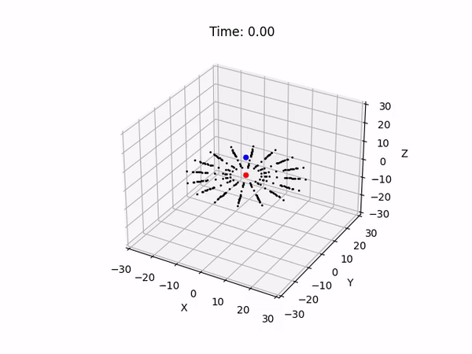

# 
UC San Diego PHYS 141/241 - Computational Physics I - Probabilistic Models and Simulations

## 
Midterm and Final Project - Team Cartwheel A

**
Team Members:** Girish Krishnan, Gokul Swaminathan, Ishaan Kavoori

### Midterm Project - Using a restricted 3-body model and a point mass for the intruder

**Code Files**

The **/settings** directory contains the initial conditions and simulation parameters.

* **disk_point_distribution.cpp** - to generate a disk of points in the target galaxy.
* **disk_initial_conditions.cpp** - to set the initial positions and velocities of all particles in the disk and save them in a file.
* **plotting_initial_disk.py** - to visualize the point distribution in the disk.
*  **simulation.cpp** - to run the Cartwheel galaxy collision simulation (using Leapfrog integration)
*  **animate.py** - to visualize the Cartwheel simulation.
*  **midterm.ipynb** - a Jupyter notebook walking through all the steps to run the code.

**Results and Outputs**

* **animation.mp4** - a video showing an animation of our simulation.
* **initial_disk.png** - an image showing the initial distribution of particles in the disk.

### Final Project - using a galaxy model from *magalie* and *mkgalaxy* and a Plummer sphere for the intruder

**Code Files**

The **/Final_Project** directory contains bash scripts involving *magalie*, *mkgalaxy*, *mkplummer*, *glnemo2*, and *gyrfalcON* to simulate the same galaxy collision as in the midterm project, but using a more accurate model.

**Results and Outputs**

These can be visualized after running the bash scripts, and **plot_energies.py** can be run to visualize the kinetic, potential, and total energies as a function of time. The file **video.mp4** contains an example visualization of a galaxy collision simulation after running gyrfalcON.